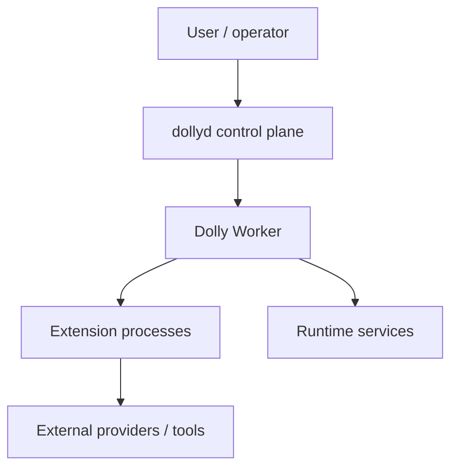

# System context

## Responsibilities

| Component | Owns | Must not own |
| --- | --- | --- |
| `dollyd` | instance registry, admin auth, worker lifecycle, config proposals | Page semantics or Extension state |
| Worker | reference machine, instance DB, graph revision, routing, leases, commit | provider secrets in Extension memory |
| Extension Host | process/framing/capabilities/fencing/resource limits | semantic repair of Extension output |
| Extension | domain computation and its private durable state | trusted Block identity, cursor commit, Page append |
| Runtime services | assets, models, secrets, observability | hidden topology changes |
| Admin clients | authorized proposals and inspection | direct mutation of runtime files or DB |

`REQ-ARCH-001` — All semantic mutations cross a versioned API and generate an
audit record. No Web UI, CLI, Extension, or research process may edit a live
instance database or configuration file directly.

`REQ-ARCH-002` — A Dolly instance is a security, namespace, storage, and replay
boundary. Block, Asset, Activation, Module, and subscription identifiers from
one instance are invalid in another even if their bytes match.

## Data flow

1. An external event or successful Activation proposes a BlockDraft.
2. The Worker resolves Assets, validates references and limits, assigns trusted
   identity, and commits one immutable Block.
3. In the same Runtime transaction it appends every durable Page entry selected
   by the frozen graph revision, reserves lossy Page sequence positions, and
   advances the durable input subscription cursors of a successful Activation.
   In-memory lossy delivery follows its separately declared post-commit rule.
4. Downstream eligibility changes; the scheduler may create a new, durable
   Activation manifest.
5. Extension work happens outside the Runtime transaction. Its result is only a
   proposal until fenced validation and commit succeed.
